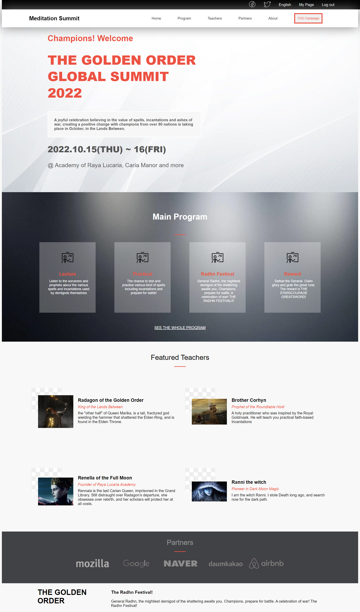
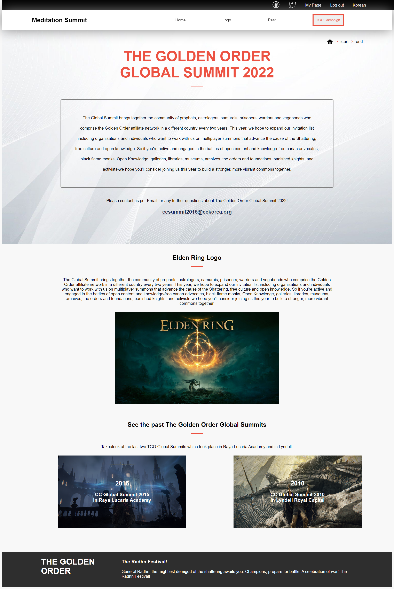

# Project Name
The Call of the Lands Between

## Built With
- HTML
- CSS
- JS

## Screenshots

- **Home Page**

- **About Page**

## Live Demo

[The Call of the Lands Between](https://rex-9.github.io/Landsbetween/)

## Getting Started

To get a local copy up and running:

1. Clone this repository or download the zip folder:

**``git clone https://github.com/rex-9/landsbetween.git``**

2. Navigate to the location of the folder in your machine:

**``you@your-Pc-name:~$ cd <folder>``**

To get a local copy up and running follow these simple example steps.

### Deployment

Here is the online version of [The Call of the Lands Between](https://github.com/rex-9/landsbetween/)

## Author
👤 - Github: [@rex-9](https://github.com/rex-9/landsbetween/)
👤 - Linkedin: [@rex-9](https://www.linkedin.com/in/rex9/)
👤 - Angelist: [@rex-9](https://angel.co/u/rex9)
👤 - Facebook: [@rex-9](https://www.facebook.com/htetnaing0814/)

## 🤝 Contributing
Contributions, issues, and feature requests are welcome!

Feel free to check [issue page](https://github.com/rex-9/landsbetween/issues).

## Show your support
Give a ⭐️ if you like this project!

## Acknowledgments
[Microverse](https://bit.ly/MicroverseTN)
[Cindy Shin in Behance](https://www.behance.net/adagio07)

## 📝 License
This project is Creative Commons licensed.
